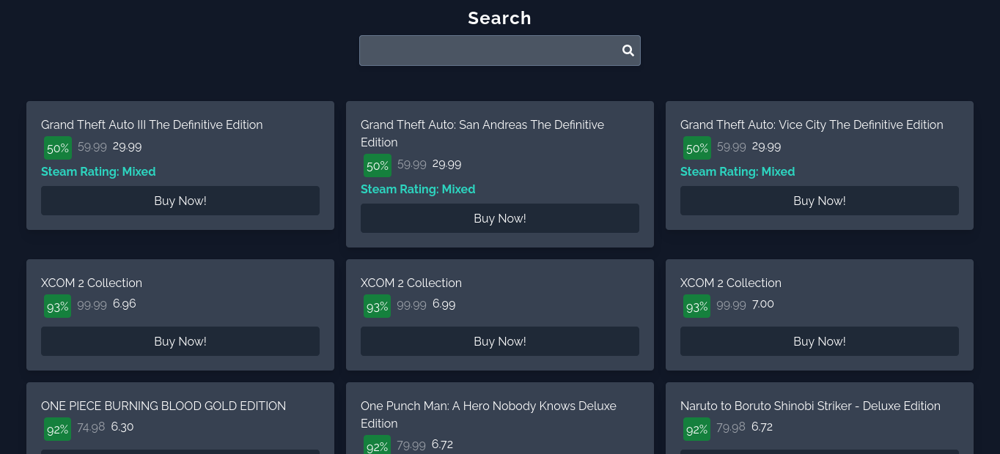

# Gameshark!

## Do que se trata o projeto?
O projeto se trata de um conexão simples com uma API pública chamada CheapShark. A API retorna ofertas de jogos em promoção e dá suporte para pesquisa de jogos em promoção também.
## Desafios enfrentados no projeto
Por enquanto meus únicos desafios foram a criação de uma pesquisa, no entanto resolvi o problema de forma local. Procuro uma forma mais simples de fazer um fetch após a submissão para ter os dois tipos de pesquisa para o usuário.

# Quer me ajudar?
Não é um projeto difícil, óbvio. Apenas algo para pôr no meu portfólio como Jr. mas se você quiser me ajudar na minha jornada, seja com recursos, conselhos ou mesmo indicação para vagas, estou sempre aberto a receber mensagens no email: elton_dev@outlook.com